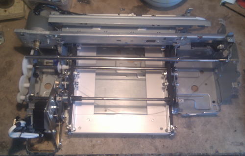

<h1>PCBen</h1>
poor man diy PCB milling machine with scrap parts. Use this URL with code repository and pages:

<h1>http://andreabenini.github.io/PCBen</h1>

There's nothing in this branch, I'm using `gh-pages` branch to document the whole process with a blog, additional resources and wiki related stuff will be published there.  
Use this friendly URL to visit: http://andreabenini.github.io/PCBen

