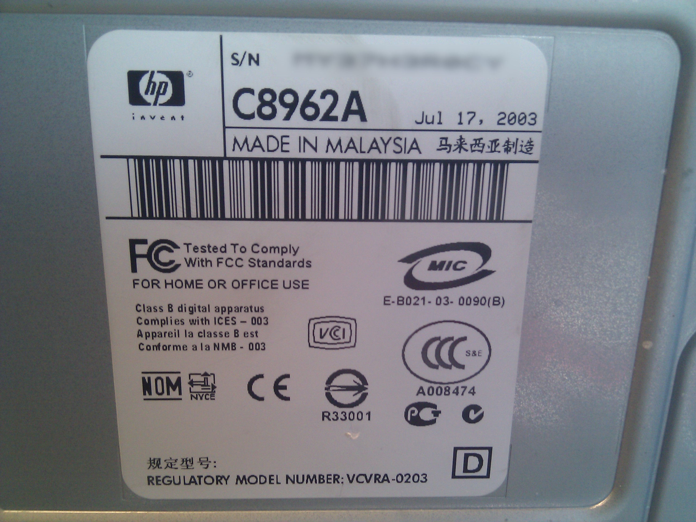

**What ?**

This blog aims to document this project and each single step involved in the creation of
a milling machine expecially targeted to PCB creation. It's a tight budget project without
fancy tools or special parts but the idea is to create a viable machine for personal usage.

**Why ?**

I have started this project because I have always wanted to create a milling machine
and I'm rather tired of traditional toner transfer method and messy chemicals. My PCB creation
skills are rather low and I always need to reiterate each single process in order to have a
passable PCB _(Printed Circuit Board)_. Even with low count or simple through hole components I
always need to correct-fix boards.

I really like electronics but I rather prefer to develop software so small boards are more a
commodity rather than my first goal, I don't need to develop RF Circuits and components involved
are mostly DIP and small MCUs _(Atmel and Texas, few SMD on hobbyist level)_. Tolerance or RF
shielding are importants but what I need is just something that barely works, nothing more.

**So ?**

So I decided to waste some time in this fancy project. I don't own a CNC, a 3D printer, a
laser cutter or some cool gadget, I'm not a pro. I'm just trying to build something with few handy
tools and some spare parts I have milling around. Expectations are pretty low and I don't have a
planned budget for it. I'm rather recovering parts around to see what happens.

**When ?**

I'm doing it for fun, I don't have any previous experience on building a 3D printer or a CNC even
if I'm quite confident with embedded MCUs, GRBL firmware and small Arduino shields, take a look at
[about section](../../about) to get an overall view of the project and follow [this blog](../) to
see ongoing documentation. I don't have a deadline or defined plans to understand when this project
will end. It's just something I do in my spare time.

**How ?**

There's a lot of manual work involved and a lot of manual tools, if you have a laser cutter or a
decent milling machine your life should be easy but for my first release I'm planning to use just
what I have around. With a complete and viable product (for myself only) I'll decide to spend some
money to improve it. This is not a professional machine but rather focused on personal usage only.

**With ?**

To get started with this "project" I've scavenged an acient printer from a trash can (literally,
see [about](../../about) section). It's an old device but the steel frame case is solid and squared,
motors are fine and sensors are decent, I'll surely get a rid of the printing part, the external
plastic case and HP motherboard but this seems a good starting point.