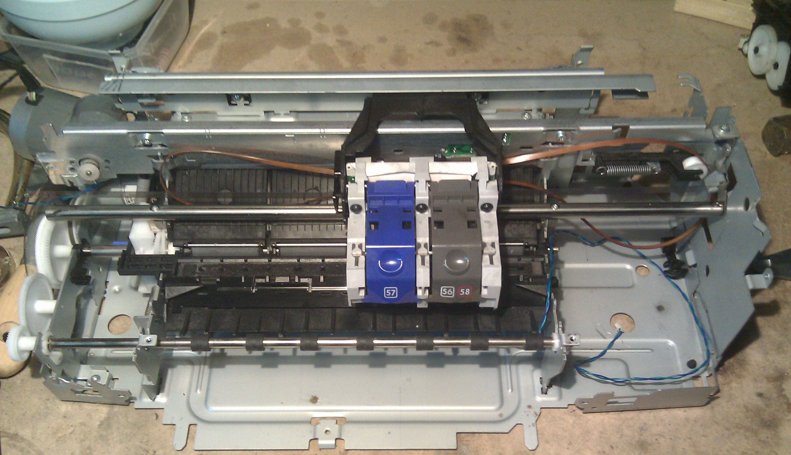
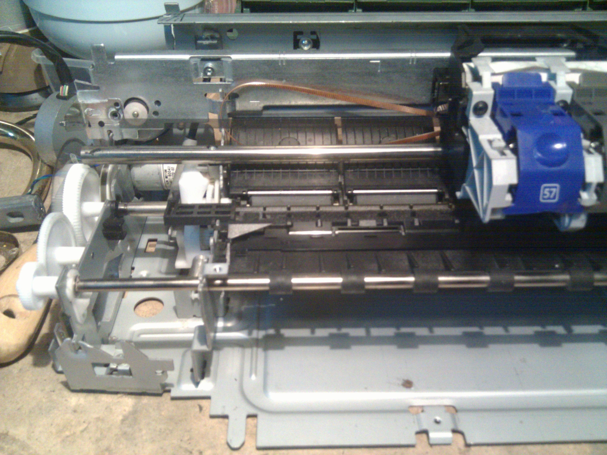
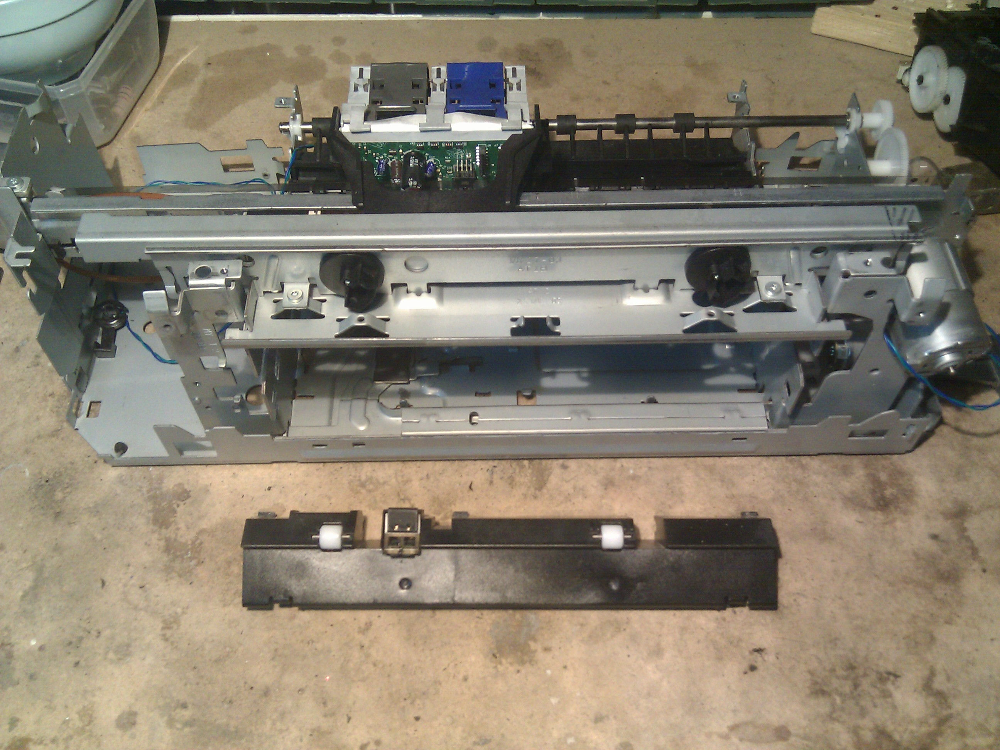
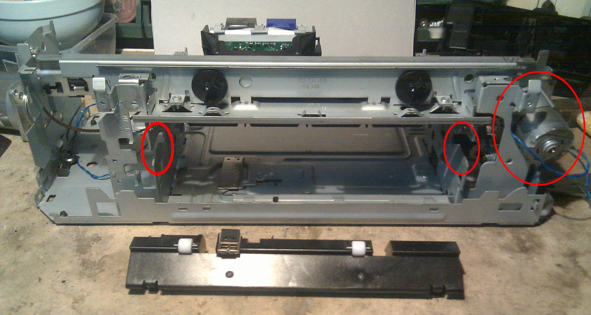
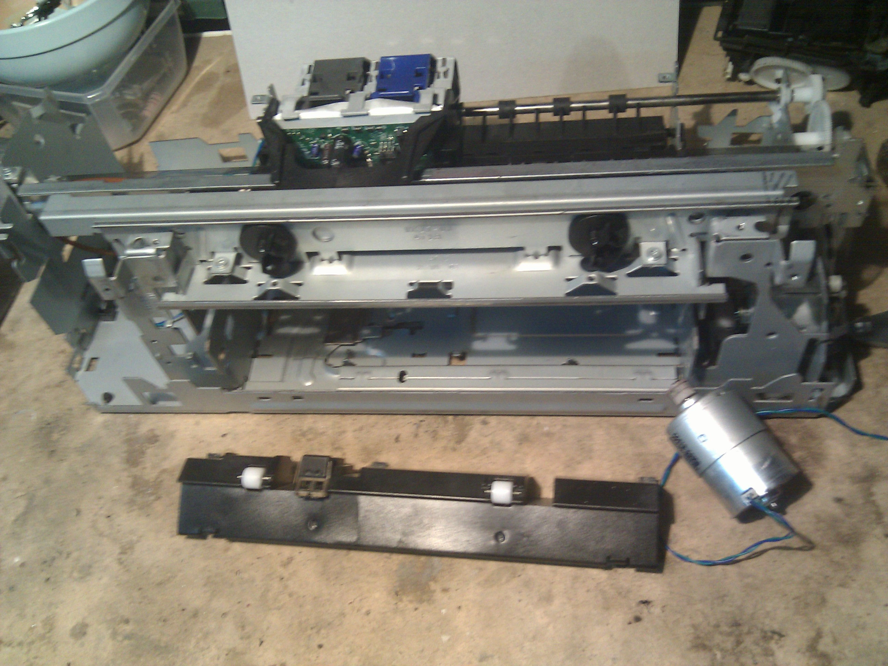

Let's get started with some real work on the printer, I have disassembled each single part in
order to understand what could be saved and what is disposable. External plastic case is not
necessary so I already put it my recycle bin. Another disposable part is the printer motherboard,
just a simple motor controller circuit with a cheap MCU and a USB connection.
There's no ethernet (cabled or wireless) or fancy features on this printer so it's not a pity
to throw these away. Sensors and mark detectors are fine and might be usable as start-end stops
for X-Y Axis, I'll keep them to see if suitable later on.  
Planned electronics will probably consist of an Arduino with a CNC shield and GRBL software, a Raspberry will be the host main controller. I'm not making any plans on that because I'm now
mainly focused on the hardware side.

Title Head picture shows the printer without case and main electronics.
Printer cartridges and ink tank are a real mess so I have already removed (and recycled) them.
Previous owner probably dumped the printer due to it, I was hoping to recover at least the print
head but it's damaged so I safely disposed it away. This picture shows the printer after a massive
cleaning, inkjet printer tank and colors are a real mess.

Motors are nice but unfortunately they're just two CC and I was hoping to have steppers to
use on X-Y axis movement with the CNC shield. I'll keep them later for different things (drill ?).  
Overall mechanics seems to be fine, cheap but fine. Steel bars are in good conditions and gears are
just dirty but quite new. Hardware case is made of steel as opposed to other manufacturers for this
segment of printers (samsung, lenovo, canon). Main X-Axis steel bar is fine and carriage movement seems to be simple
but strong, here's a closer detail of it

On the back there's a lot of plastic: paper holder, sheet guidance pulleys and few spare parts I don't
need so I'll drop them all.  
Bottom back steel frame of the printer needs to be cut to have some space for a movable Y-Axis
carriage, I'll use my Dremel for that.
Here's another shot without the paper holder and all that plastic stuff.

There is also a moving steel part that was used for manual paper loading,
I need to remove that too but it's not a real problem yet.
As you can see from the photo below I have temporarily removed a steel rod that was housed
where two red ellipses are as well as the ink head carriage motor on the right.

This is a CC X-Axis motor and that's not what I'd like to use with my Arduino CNC shield,
luckily I have some spare NEMA 23 motors taken away from an old thermal transfer printer.
No need to worry now.

Next step will be focused on making space for recycled NEMA motors, remove more
plastic parts and create some room for future Y-Axis carriage on the bottom of it.
