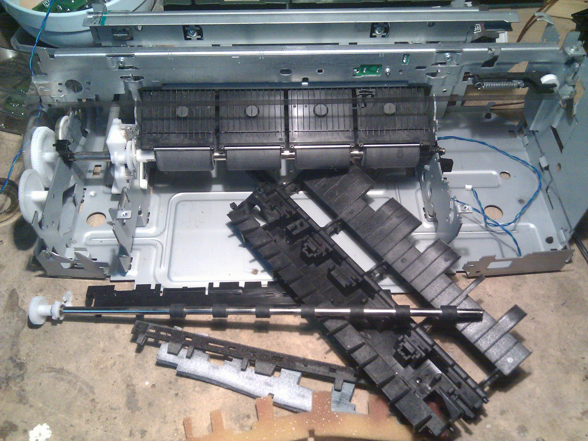

In this phase I'll complete printer dissassembling, this is fun and really
easy, whatever part of the printer built with any kind of plastic that is not
needed for the chassis robustness will go away. Plastic shields originally
built for driving the paper during print, small pulleys, static electricity
brushes and more generally each part that could lead to some friction will
go away.

I'll temporarily remove steel rods too but I'll keep them apart, after some
cleaning and few mods on the steel frame I'll surely put them back again in
the original position.  
Plastic gears on the left will leave there untouched, previous experience
with other similar parts teached me to keep them as they are in order to
avoid any damage in the construction phase even if they'll probably be
covered with some iron powder during case mods.