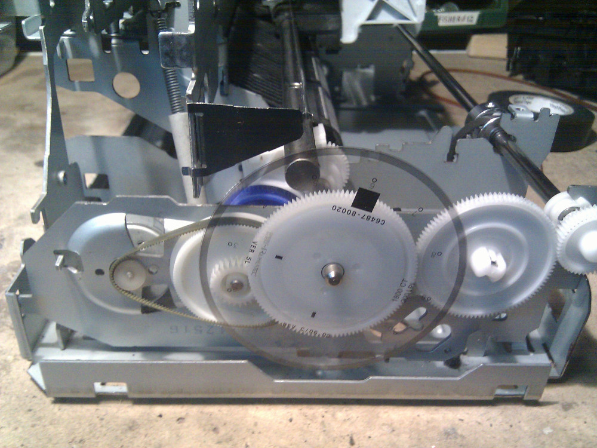
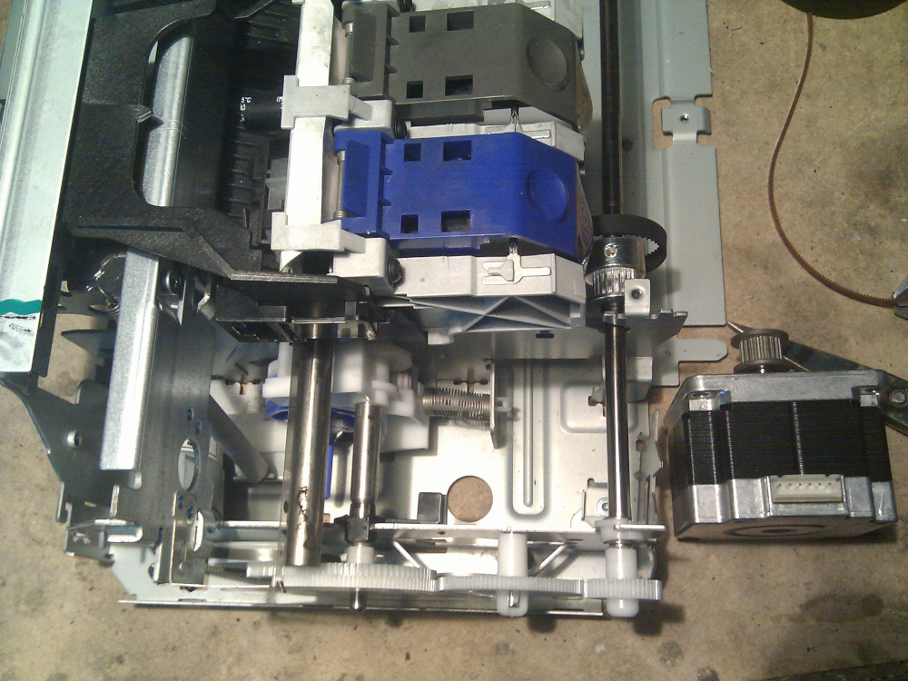
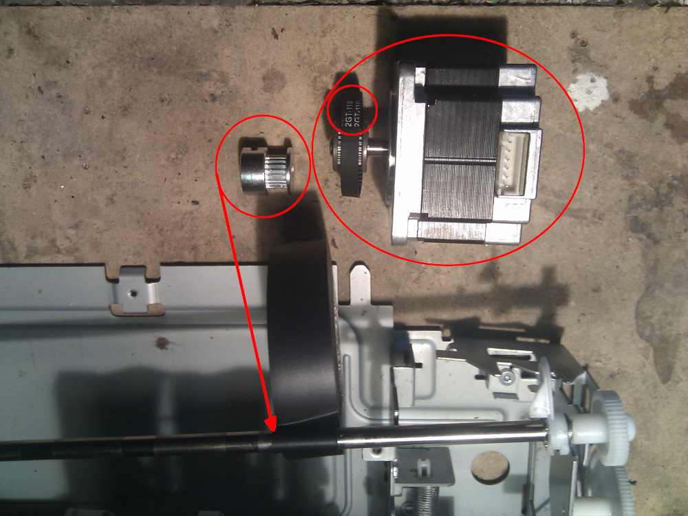
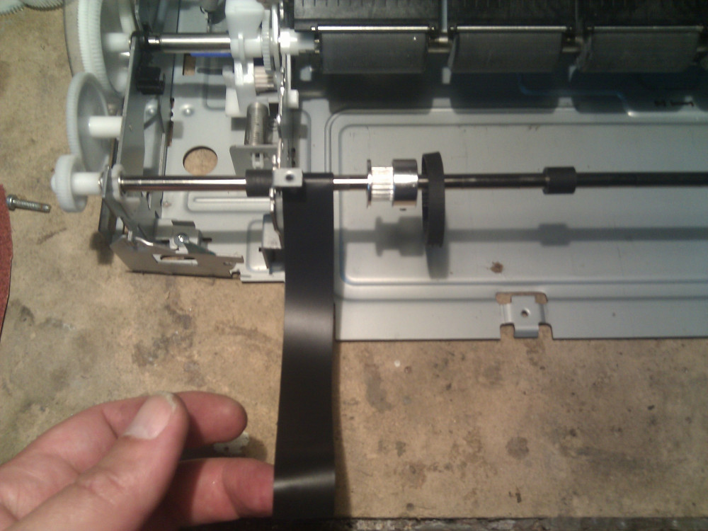
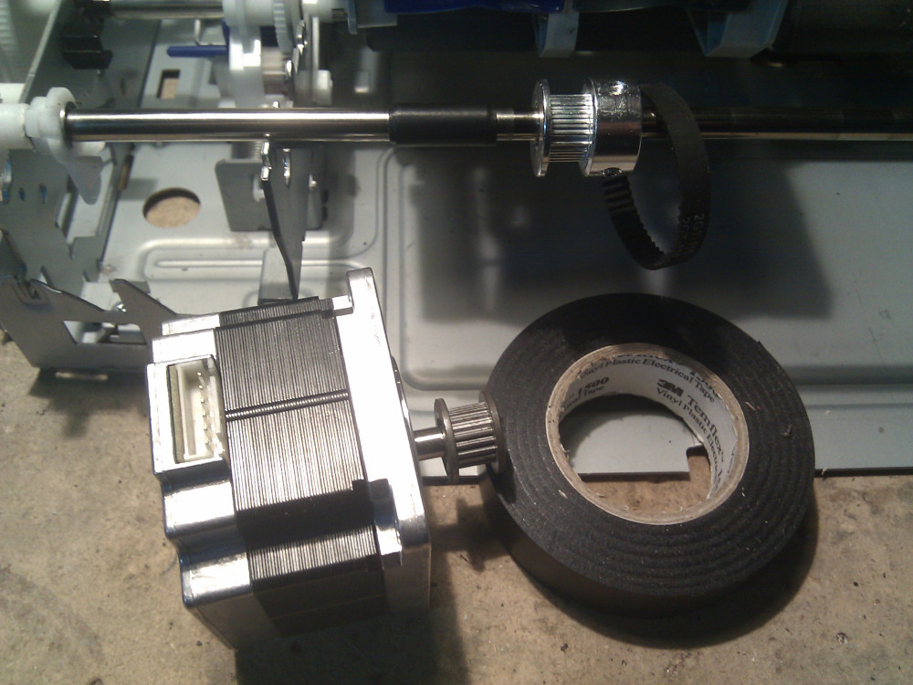
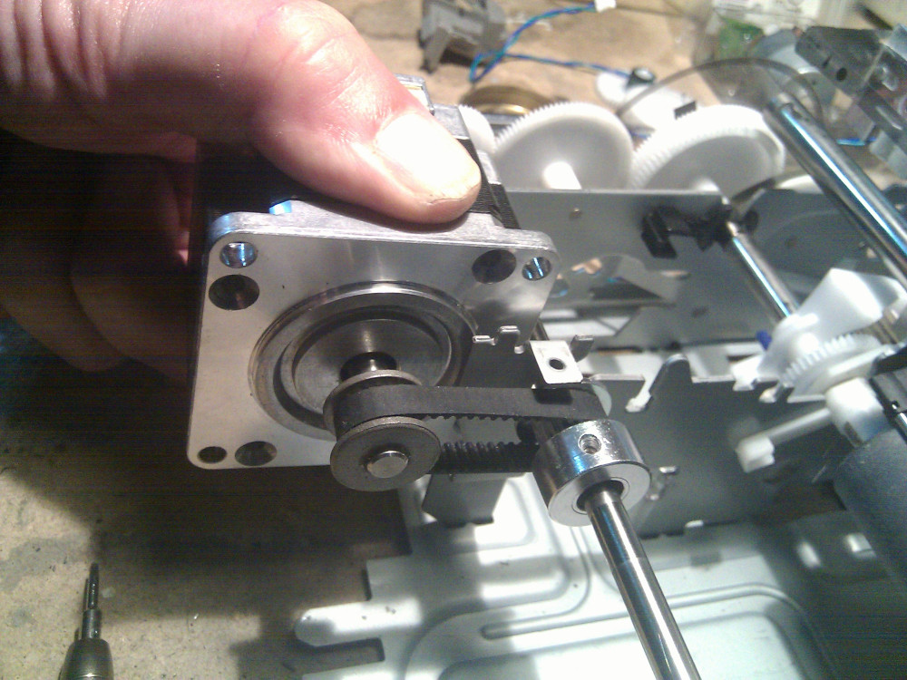
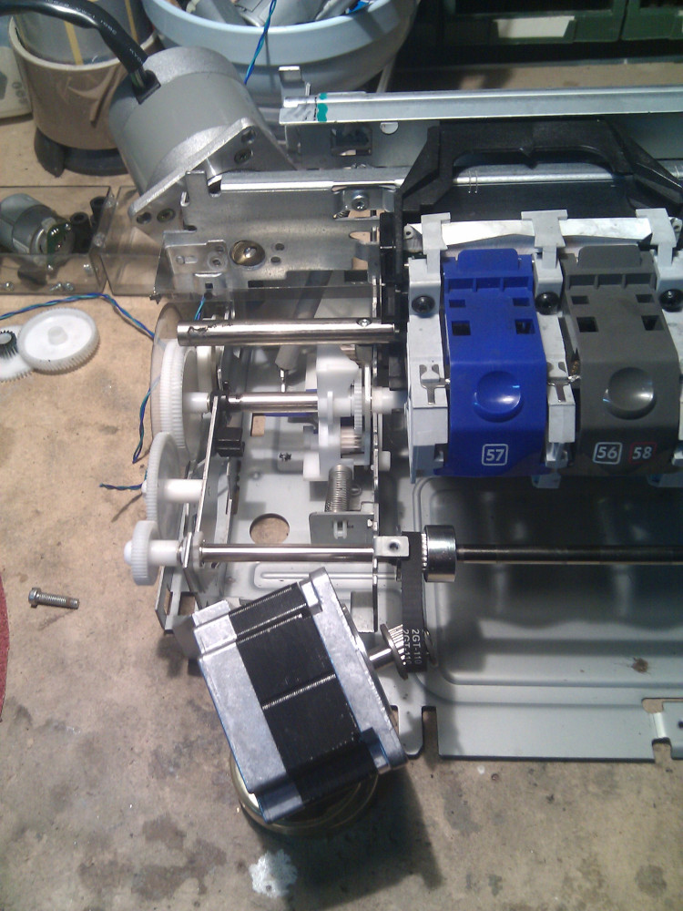
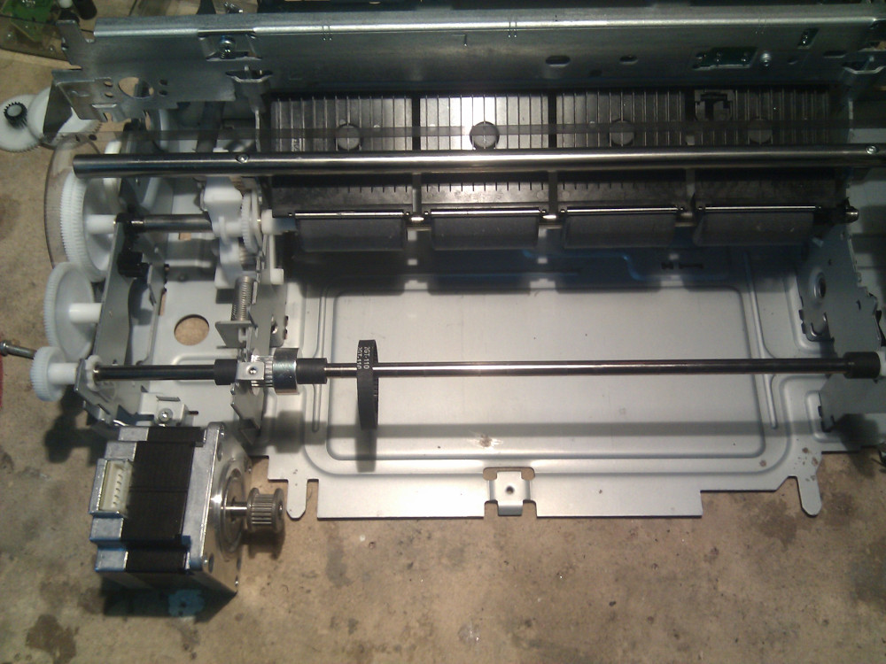

Now it's time to modify the case in order to use my Nema 23 motors, as you can see from the
[BOM](../../bom.html) I'm using two different motors I have recycled some time ago. You may use
two identical motors or whatever you find around, it's up to you.  
Original motor designated to move the paper was a Continuous Current one so I have removed it and 
substituted with a cheap NEMA23 stepper. The only problem is where I can add it without dismantling
the efficient gears movement and still use the printer steel rods for traction.  
HP was using this CC motor with an optical sensor attached on the bigger gear to count rounds, I don't
need the plastic part of the gear so I decided to remove it, the same goes for the motor and its
thin pulley on the left

There's some space between two bigger rods but if the motor tops these steel rods there could be a problem with the carriage movement so I have decided to move it on the outside. Next challenge will be to fix it firmly to the case but I'm mostly concerned about the pulley.

To solve this problem I'll use a GT2 pulley (inner:8mm), a closed loop GT2 110mm (6mm width) belt and
the Nema motor.
External steel rod is only 6mm so I'll use some rubber tape to make it thick in order to keep the pulley
firmly in position

As you can see it's really easy, hopefully it will stay in position without moving too much, after that
I'll place the GT2 pulley over it.

So this is what I'd like to have, excess rubber tape can be removed with a utility knife.

And this is the idea for some sort of transmission on Y-Axis even if I don't have a clear plan on how
to keep it in place

I guess I need to create some kind of support connected to the printer and coming out from the case
in order to keep it in place.

After securing the GT2 pulley I'm placing these small rubber bands previously used for moving the paper
at the end of the rod so it won't move too much. I've tried to manually move the rod to see if the gears
are still turning and this seems to be a good working setup.

