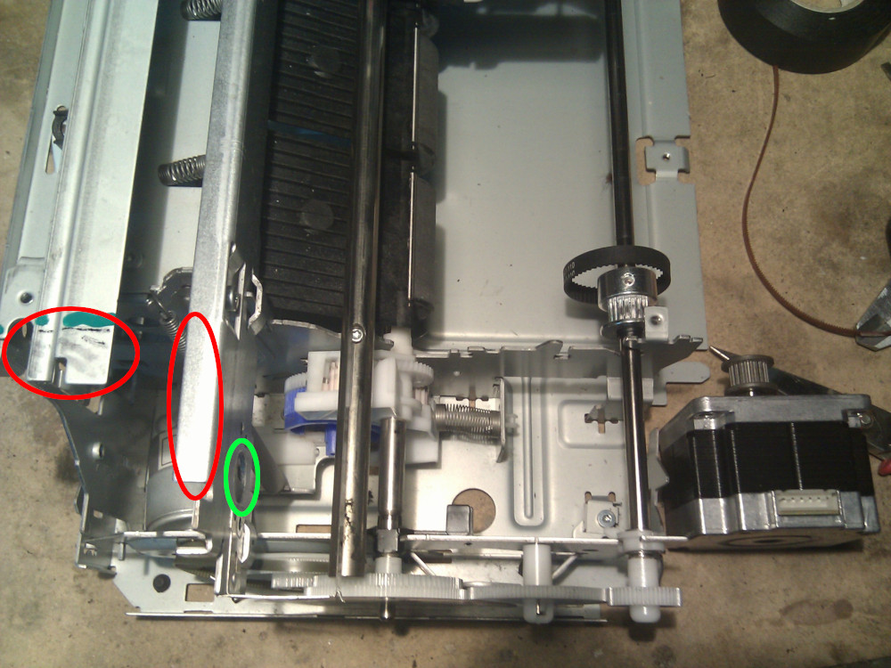
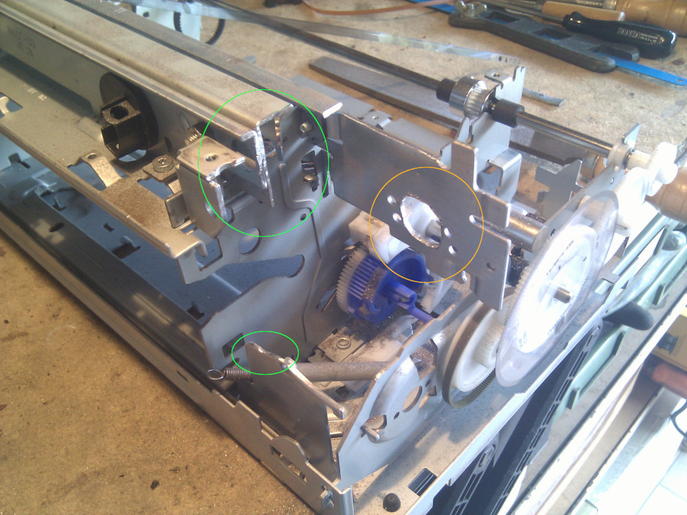
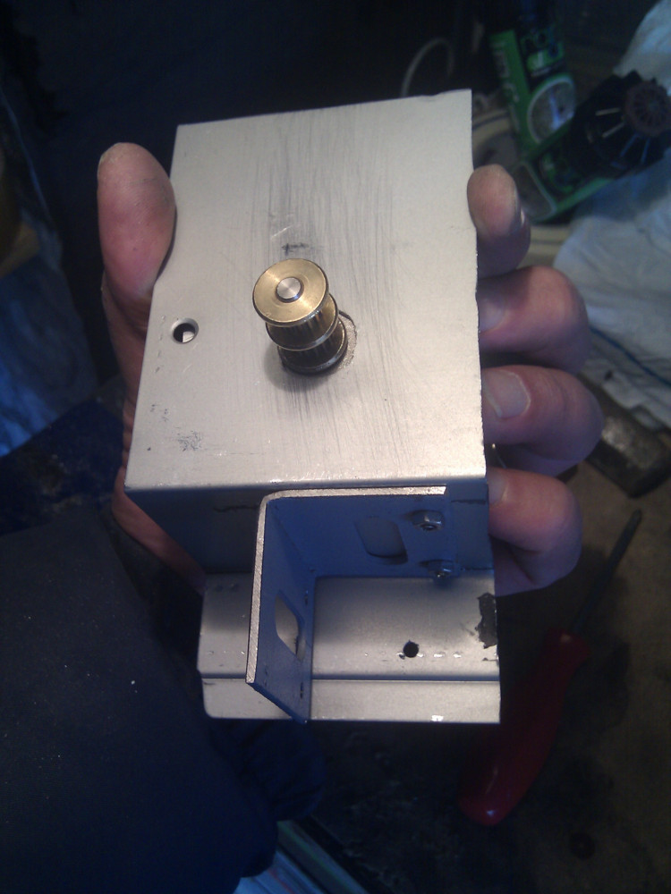
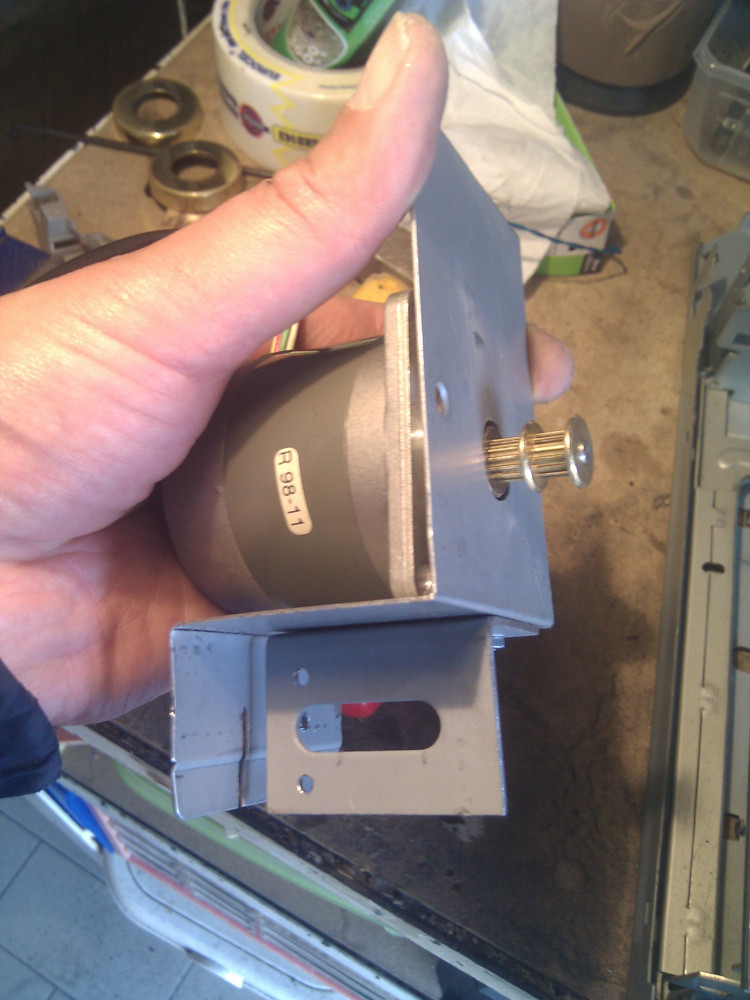
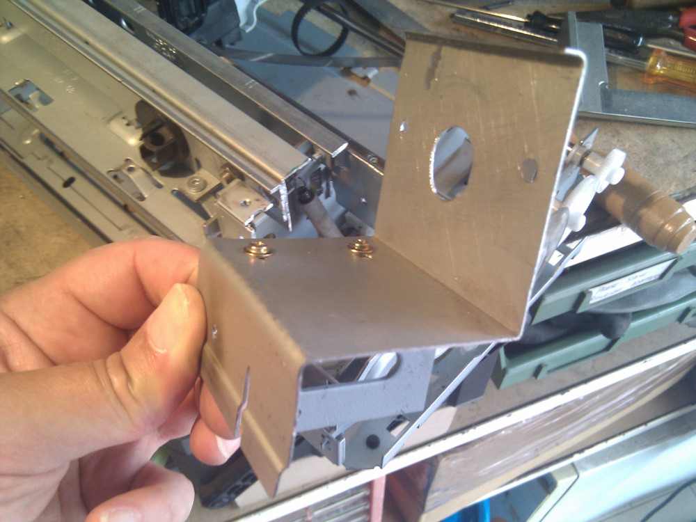
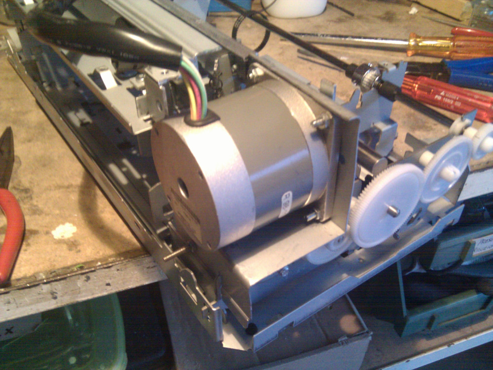
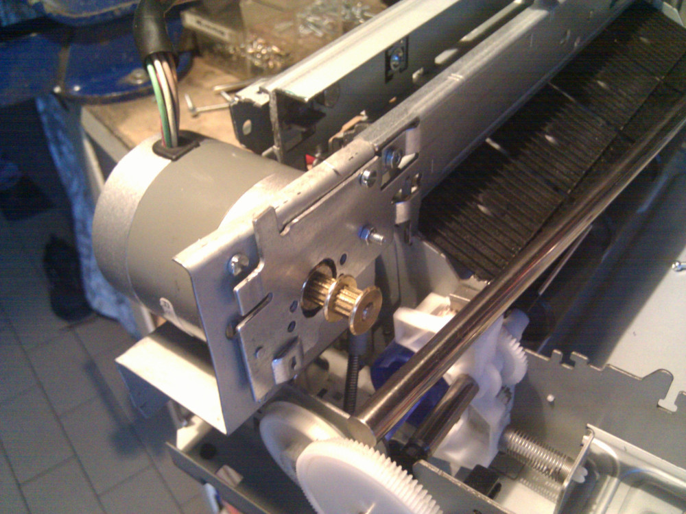

_Small spoiler, the image above shows the final result of it._  
BTW: In this section I'll document X-Axis creation by replacing original motor. As already seen
for the original Y-Axis CC motor used originally to load the paper even this one seems to be
too small for moving an utility tool or something loaded in the movable carriage. I've decided to
replace it with a solid NEMA23 stepper, it's not one of my favorites but seems to be really solid
and heavy, it's probably the best (recycled, so free..) I have without purchase.  
It's a NEMA 23LM-C038-04 from Minebea Ltd. as you can see from my
[bill of materials](../../bom.html), it's fat 'n' heavy, it has 8 wires so I have figured out how
to connect it with a multimeter, I didn't had so much results from Internet so I wired it on my own.
If you have information about that please drop me a note and I'll be happy to compare my info with
you.  
**NOTE:** This motor it's **_not_** strictly needed, you may use your own favorite NEMA23, this
is just a scrap one I already had, there're probably better solutions or alternatives to it.

To better fit new motor I have decided to place it in the same position of the original one but I
need to cut some steel do adapt the case to it. It's even thick and heavy so I won't rely only
on the front bar for fixing and I'll build some kind of bracket for it.  
As you can see from the image below I need to remove few steel parts (in RED) and enlarge a small
hole (in green) that was previously used for the original motor

And this is the result after few minutes with my Dremel. You don't have to own a Dremel to cut it
but some sort of dremel-like cutter tool like that really helps with these things.  
Green part shows you I've removed the upper right part of the printer case, it's not yet a problem
but I prefer to enforce or add some reinforcement steel later on.  
Yellow circle shows my operation with a small drill and a file, not really precise but hopefully
it's enough to insert my new motor.

Now, I have taken few scrap aluminium parts from an old PC power supply case and a small metal
profile, after few bends and an hole for the rotation shaft here's what I'm planning to use.

And here's another view of it. Pretty simple but hopefully robust enough to keep it steadily in 
position.

Top part has been lightly bended (again) to keep motor in place, two holes on the front side will fix
this bracket to the printer chassis with two screws, you can even use a welder (if you have it) to
keep this part in place, hopefully you won't move it from there anymore.

Other four holes are needed to fix the motor with screws to the chassis, as you can see this
will be final result.

And this is how it looks like from the front. Motor bracket is not perfectly bent on the top edge
but it's still fine, front screws will keep the motor in place and stable

Your hardware job will vary on the motor size and what you have around to keep it in place but
hopefully this will give you an idea of what it's needed. Using a cutter on steel produces massive
amounts of powdered iron but there's no need to worry about that now, you can carefully clean
each single part (gears too) later on with a small brush (or a toothbrush) and some motor oil