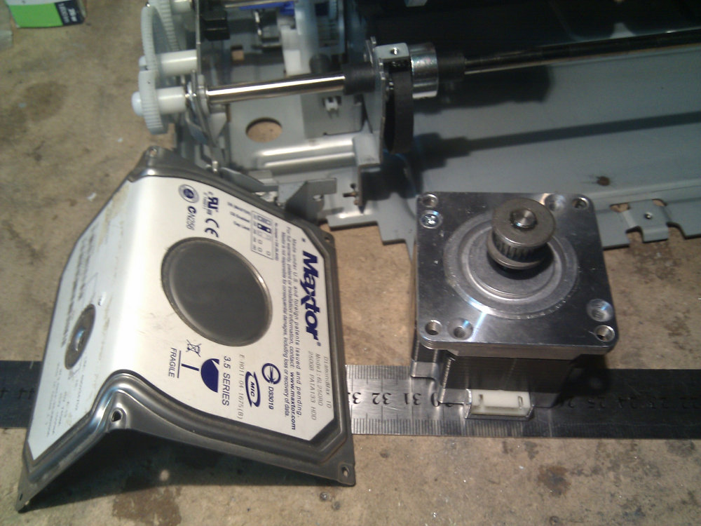
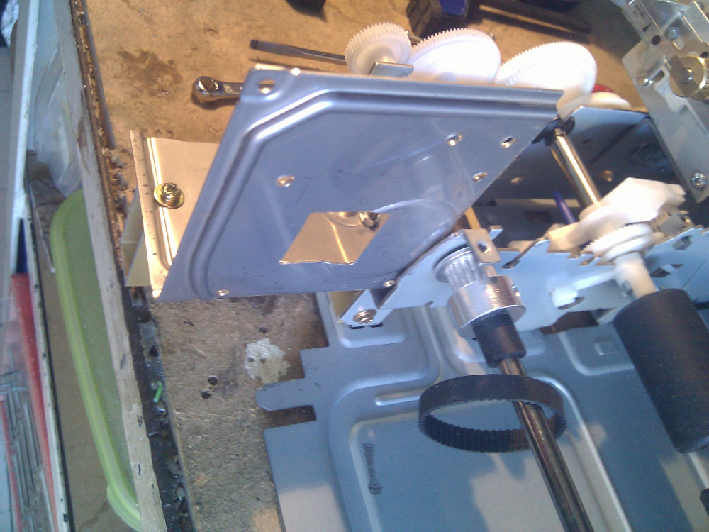

I'm not a great planner and as you can see this project is not carefully built from scratch
with my favorite 3D program. I'd like to plan materials and fixing solutions even if the design
is mostly handmade with what comes around for free, it might be an hands on project with spare
materials but there's always a level below which you shouldn't go. This post documents that level
and a predictable failure, this is what happens when your brain is not connected to the body and
you want to waste some time cutting materials with no particular reason.  
In a more optimistic way I'd like to see it just like a test, I've wasted some time, I've learned
something, I've repeated the whole process to produce something reliable.

Everything starts with the idea of building a bracket for the Y-Axis, I was planning to place the
motor few centimetres above the base level of the printer and fix it to some sort of bracket.  
Inside my junk drawer there was an acient 3.5" HD and I was looking for a small piece of aluminium
and a sad idea comes around...

Guess what ? I had found my aluminium part... so after bending it at 90° I was in a hurry of taking
my drill and place some holes around to create few fixing points for the motor and after few minutes
with my dremel in my hand (yeah, I really love to use it on whatever material I have...) I even had
a square hole for the motor shaft.

To fix it firmly I was hoping to keep it in place with a small aluminium profile placed between
the printer and the new bracket. That profile was not so firmly attached because just one part of
it was connected to the printer and the weight of the bracket and the motor was on the opposite side,
so this was the first problem

Just after placing the motor the real problem was: how can I fix the motor and keep the belt firmly
pulled without too much waverings ? Ok, this is a failure, it's better to rip it off and do something
else. I'm still keeping the photos to think about it the next time I'd like to do something without
a plan