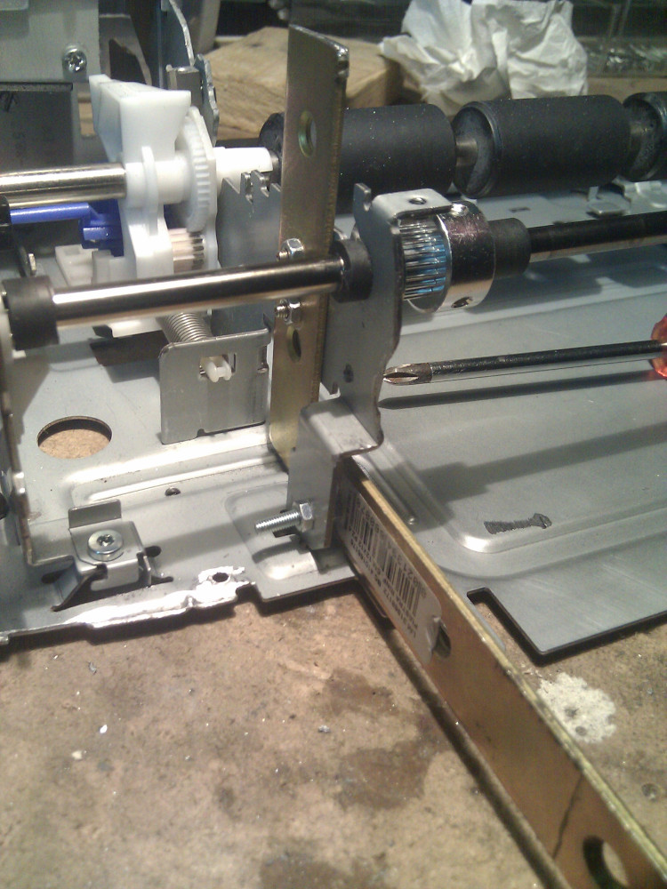
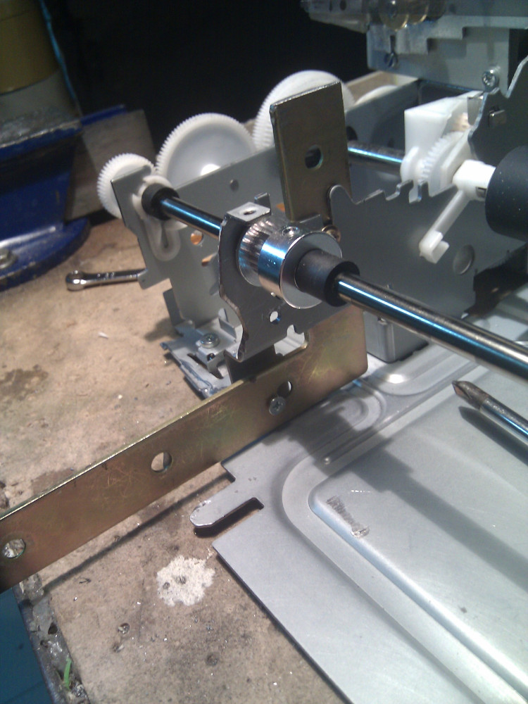
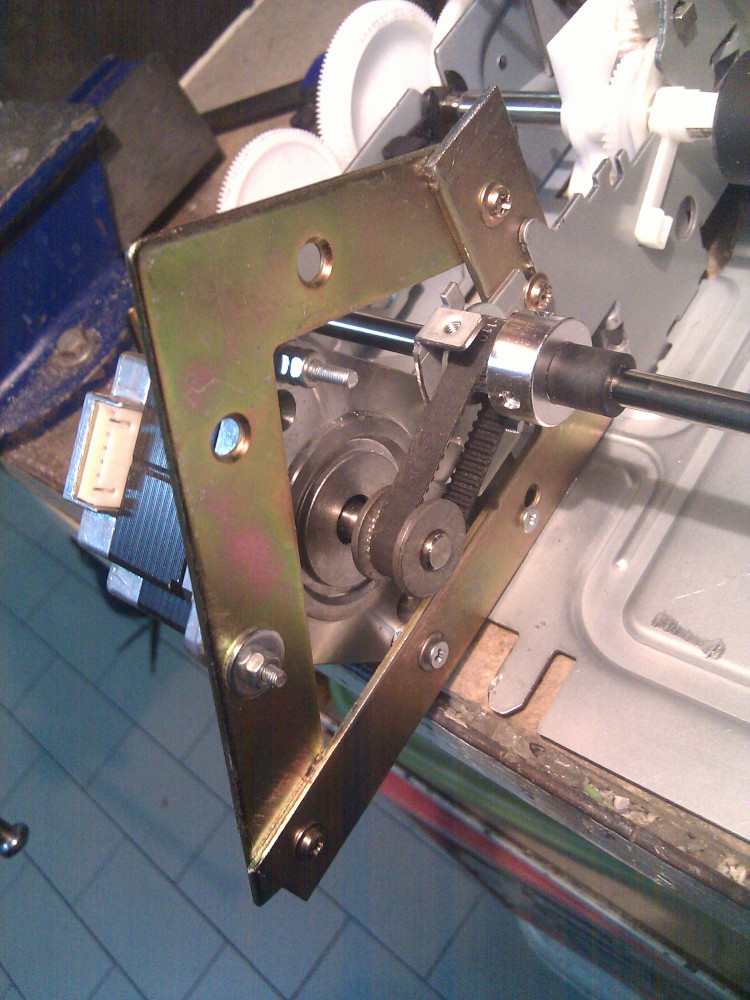
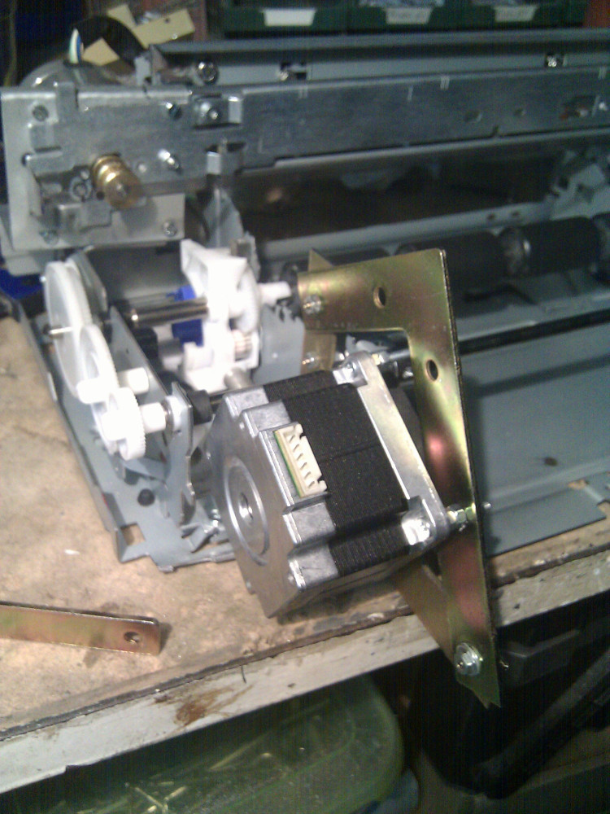
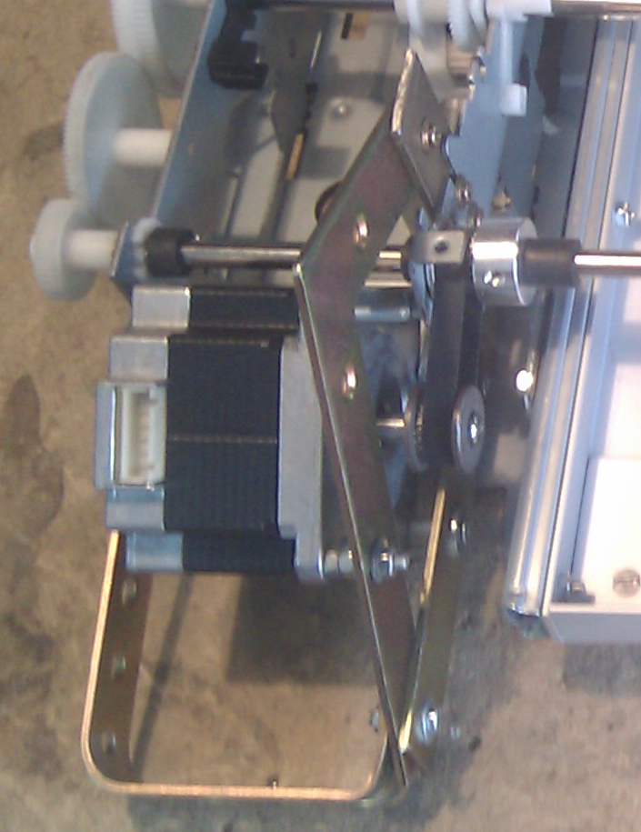

After an <a href="../20191022 Y-Axis Bracket [fail]/">unsuccessful attempt</a> with my previous
Y-Axis bracket I have decided for a simpler solution based on a square shaped steel bar.  
Steel bars are strong, cheap and durable enough to keep the weight of a small NEMA23 stepper motor.
To start with it I've taken small 80x80(mm) bars I had around, I guess you can get them for a couple
of bucks (each). I generally prefer inox steel to avoid corrosion and keep them in good contitions.
There're no particular indication on how to fix them, I've just drilled #3 (4mm ø) holes to keep it
tied to the printer body with spare ø4 screws.

Here is a view from the other side.

After fixing the first squared steel I have added a new piece in order to obtain some sort of rhombus,
with it the motor might be connected as the picture shows below.

As you can see from the other side it seems to be a stable fix, I can even move or tilt the motor
to properly insert the timing belt during assembly.

With a small hunk of metal I can even avoid vertical oscillation and keep the bar fixed around the
stepper motor.

Absolutely easier than previous solution, seems to be reliable and without wobbling. I still need 
an acknowledgement after a long job run but printer chassis seems to keep it up without too much fuss.