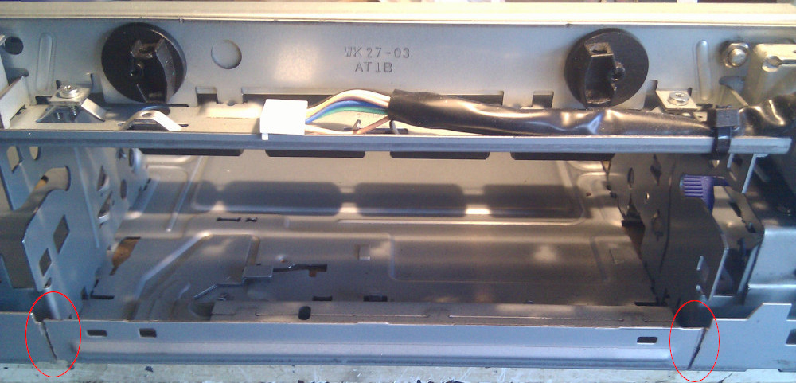
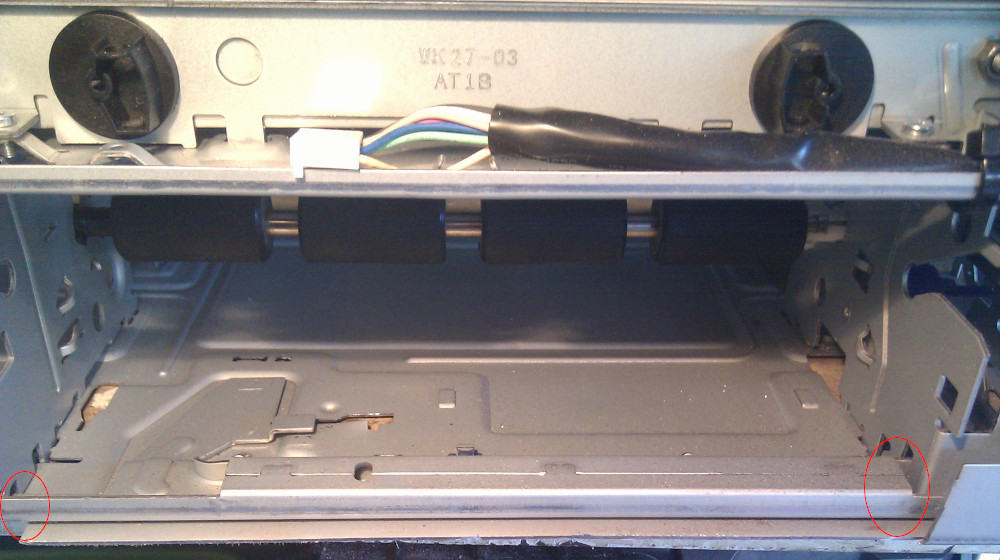
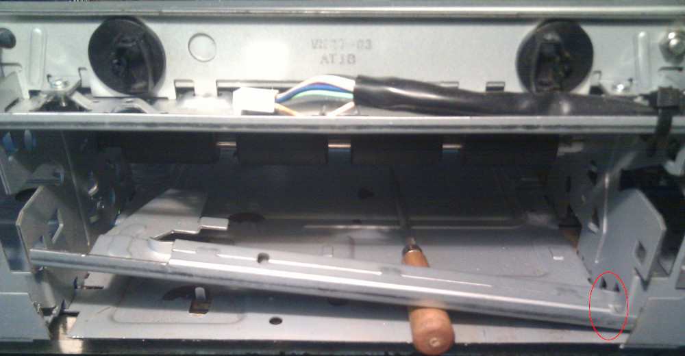
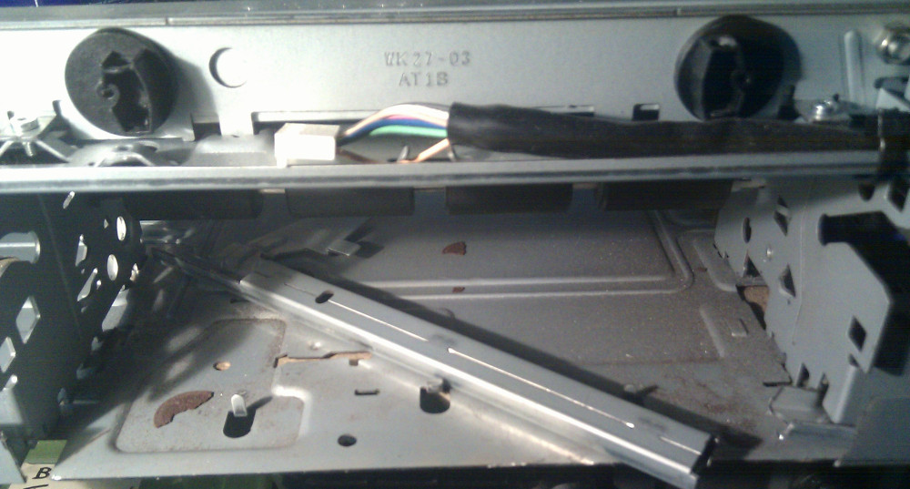
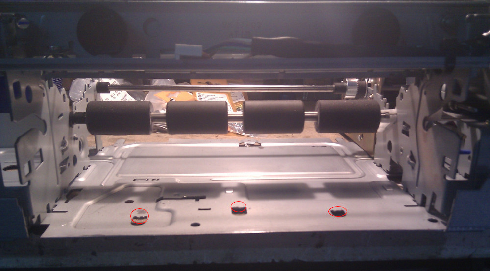
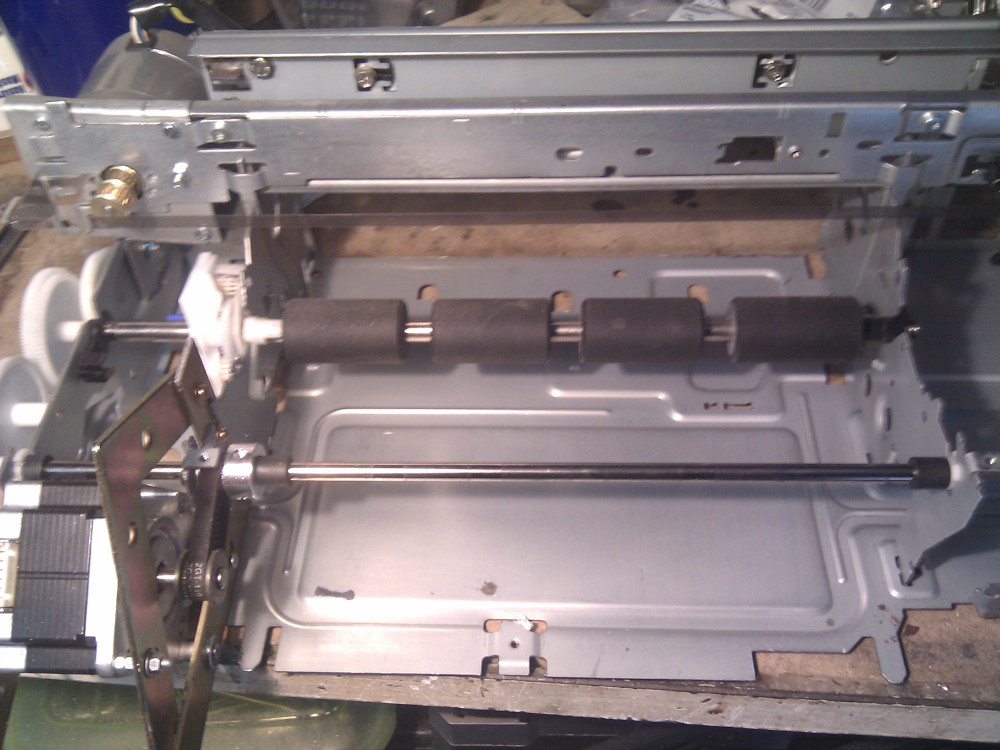

Few minor hardware adaptations are still required to provide space for future Y-Axis movement so
I have decided to remove surplus aluminium from the back of the printer.
Before that I need to remove rear steel bar and plastic guides previously used for paper movements
(see picture above). Plastic parts are disposable but _this_ steel bar is very important for me
because it'll provide transmission on future Y-Axis pulleys. I'll work on that later on.  
There's a small steel part from the chassis frame that has to be removed so I have marked two cuts
on it with my dremel. The photo below shows exactly what I've decided to do

Now after a longitudinal cut the frame is finally free from it, the same procedure must be applied
to previously used paper loading steel bar, ellipses below shows my cuts.

This paper loading mechanism is slightly more complex and tethered to the chassis in multiple joints
so I need to remove it with multiple cuts. I'm still using the dremel for it because I don't want to
bend the frame in any way or damage future parts with massive rip off even if I'm using a lot of 
small abrasive discs for it

Solved ! the loading paper bar is finally gone !

I just need to bend or cut small steel parts previously created to keep the loading bar in position,
image below shows final result of it

And finally I have a clear space for y-axis movement, after all this cuts some cleaning is required
but current result seems to be fine. Now I can focus on the creation of some sort of sliding bed that
can be placed where the paper loading bar was and finally have a quite good Y-Axis.

