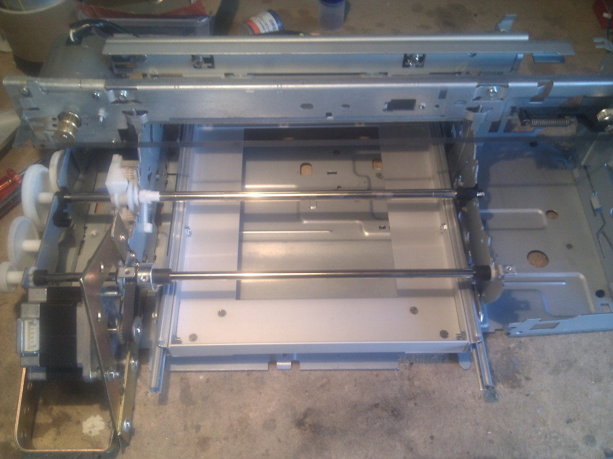

To create a small caddy with cheap materials I have decided to use two ball bearings drawer slides.
They're not so accurate but I can hopefully drive them with GT2 pulleys to increase precision.
I've bought them from a local hardware store at a cost of ~4.50€ each as described in the
[BOM](../../bom.html).  
For the caddy I'm also using #4 metal square brackets and some aluminium angle bar for the base,
I already had these materials but you can purchase something like that and adapt to your project
quite easily.

To make some tests I have taken a 30x30mm square bracket and fixed it to the printer base with M3 nuts
and bolts. On the other side I have cut the aluminium angle bar to properly match drawer slide length.
This seems to fit fine and with a proper alignment it could be a good starting point for my metal 
drawer. The aluminium bar will be the background for the caddy.

With a small M3 countersunk head inside the sliding drawer I can keep the nut on the outside.
There are no metal parts grinding so I can create the base for the drawer and fix the angle
bracket to the metal frame. After proper match and alignment I can finally cut outside bolts to
get proper length.

With two sides of the metal drawer I can easily cut remaining aluminium angle bar pieces to
properly match the desired width. As premised before I don't have access to laser cutters,
CNC machines or 3D printers so I have manually cut and carefully adapted my aluminium bars.
If you have some machinery this can save you a lot of time but with a steady hand you can barely
do it manually too just like I did.

A guide is mandatory to perfectly align your pieces, as you can see I have also drilled them and
inserted M3 bolts to fix the newly created drawer. Don't turn screws too tight, keep the whole
drawer in position, adjust everything with the guide and carefully screw the bolts until it
keeps a solid position. Double check with your guide at the end.

As you can see my bolts are longer but that's not a real problem, when you're set with the guide and
everything works fine you can finally cut them.

Now everything seems to be squared and tight

Rear view and bolts

Now it's time to accomodate the caddy in its final location but I still need to remove rubber wheels
previously used to move the paper, a common utility knife can do this kind of job easily.

and this is the steel bar without rubber parts

On the back of the printer I have placed two metal square brackets to keep the sliders steadily 
connected to the frame.

After a lot of sliding tests I have finally tightened the nuts to the frame.

and here is final result with caddy moving forward

