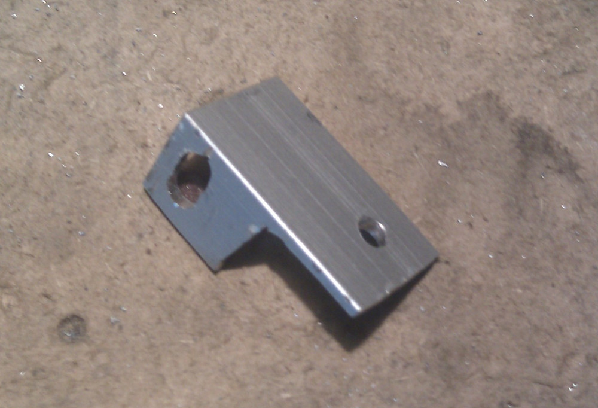
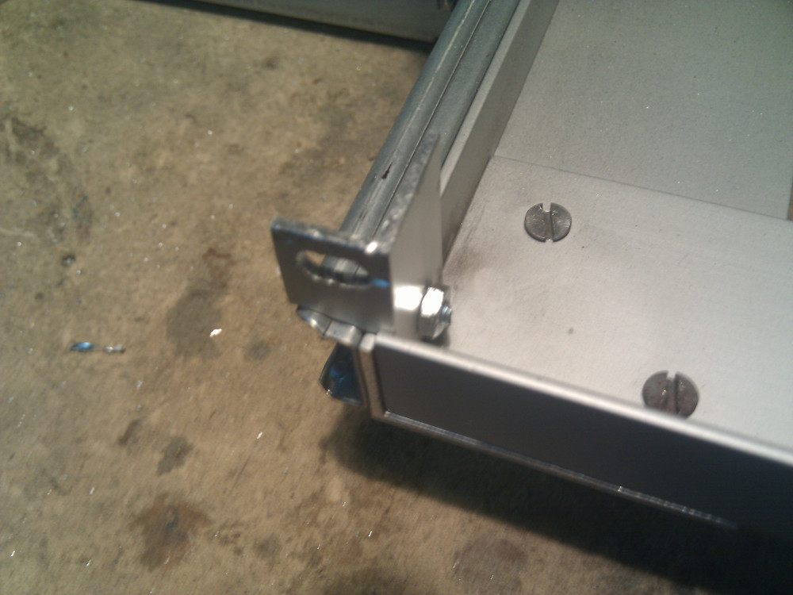
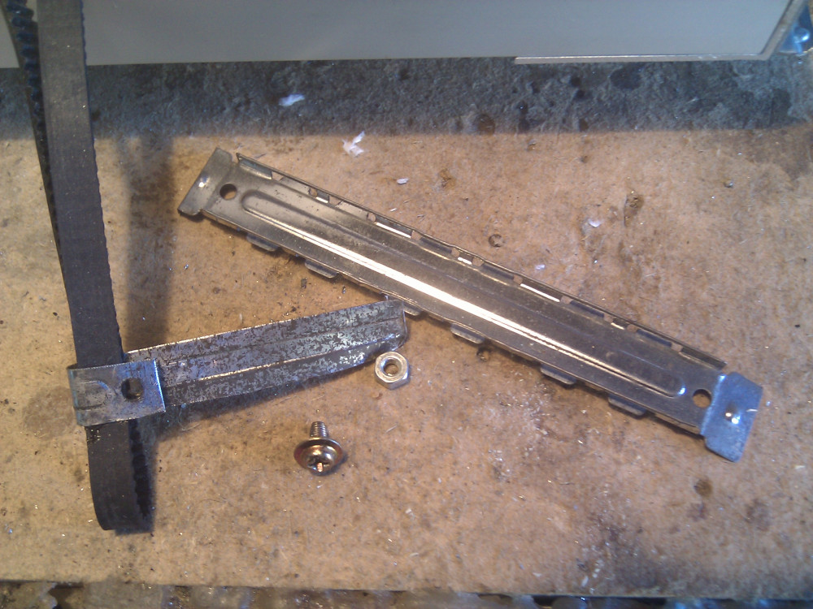
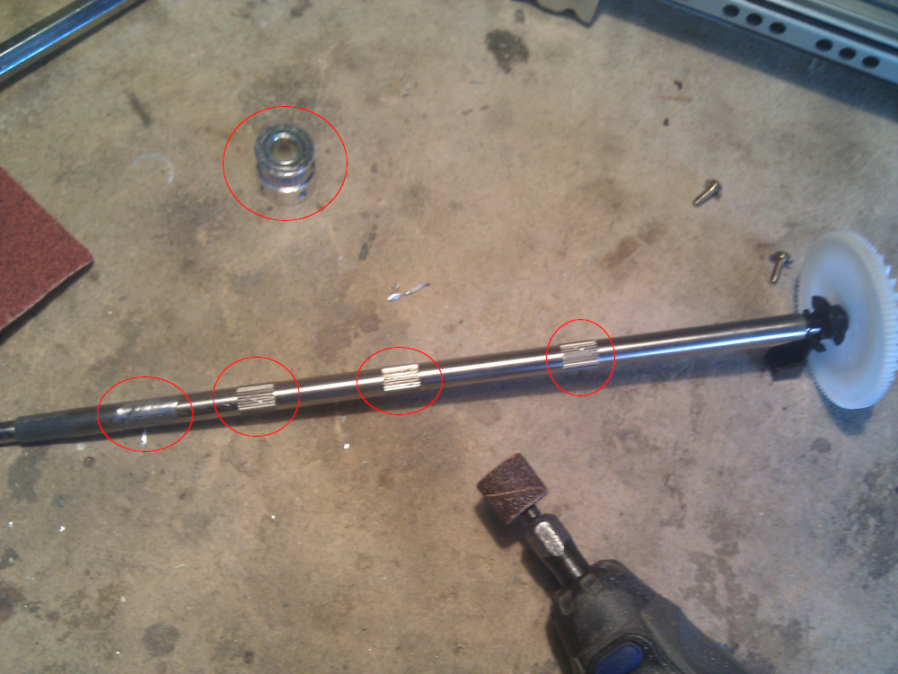
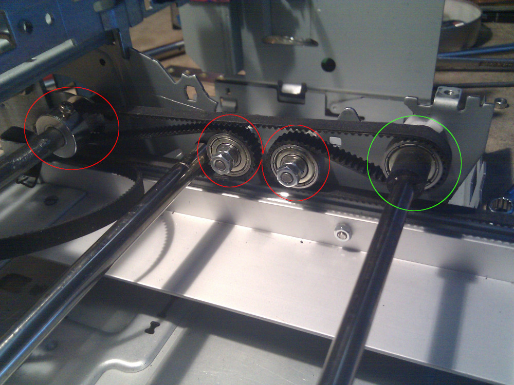
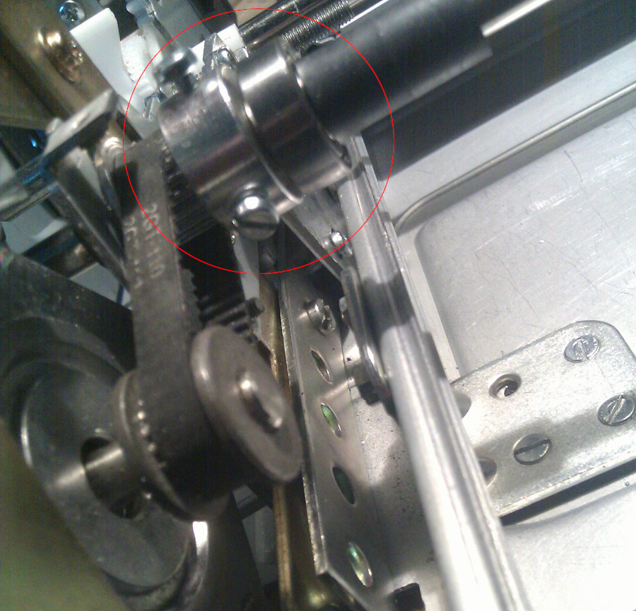
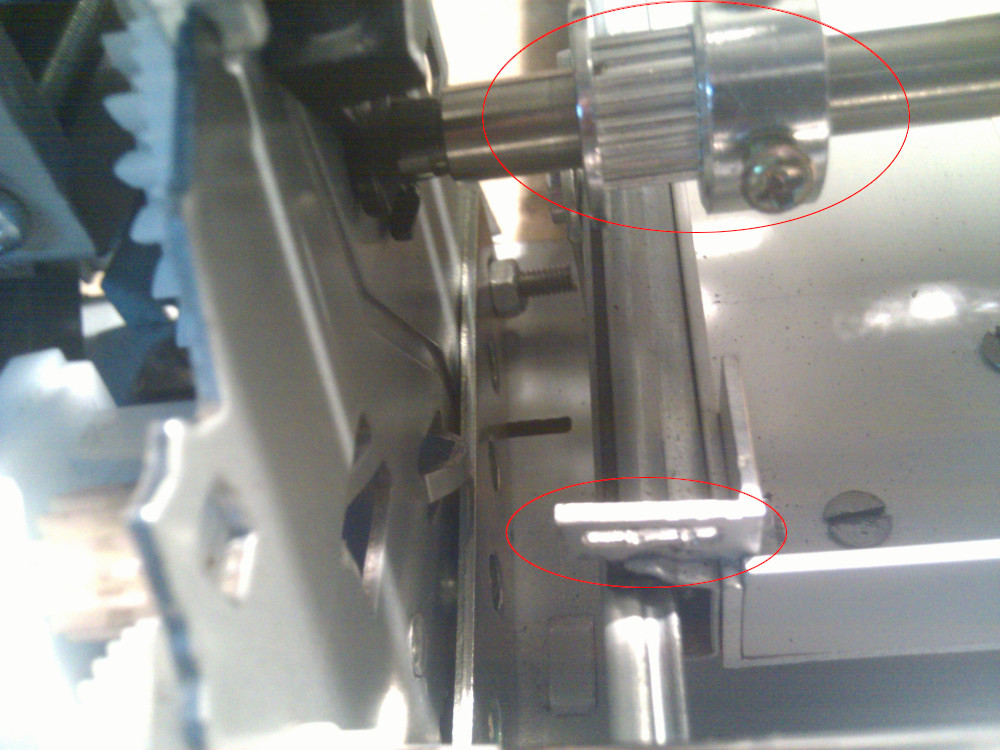

After creating a solid steel cart it's time to connect it to the motor shaft with some pulleys
and belts. I'll use some GT2 belt to connect both sides of the pulley to the motor shaft, in this
way it won't shake too much when it moves along Y-Axis.  
Before that I need to manually create 4 brackets with some spare aluminium.

and finally connect these brackets to the edges of the cart, I'm using the same bolt that keeps
the drawer slides linked to the aluminium angle bar. The belt will move over the drawer slide
to maximize inner working area for the mill, there's no need to dedicate additional space to it.

To fix the belt to the bracket I'm just using some scrap and thin aluminium, a M3 screw and a nut
for it. Aluminium has to be thin, in my case I've taken it from spare PC slot cover.

[Previously saved rear steel bar](../20191025%20Making%20space%20on%20the%20back) will now be used
to keep two timing pulleys in place but before that I need to slightly adapt the steel bar.  
Timing pulleys have a 8mm bore and this bar is **exactly** 8mm. Previously used plastic parts
were fixed on knurled parts of the bar, these parts exceed the 8mm so I need to grind the bar as
you can see from the picture below. A really easy fix with a small sandpaper disk.

Now it's time to use: the belt, the timing pulley and three ball bearings as you can see from the
picture below. The timing pulley (ringed red on the left) is fixed on the steel rod and
takes movement from it. Two ball bearings are placed around two fixed pivot (ringed red in the middle),
these pins won't move at all and the bearings are just there to keep the belt tight in place.
On the right side of the picture there's another ball bearing placed on a steel rod (ringed green),
this rod moves in the opposite direction of the belt, the ball bearing will keep the belt movement
insulated from the steel rod. In this phase I have drilled two 4mm holes for keeping two pivots
in place.

On the left side of the caddy you can see where the ball bearing is (ringed green in the previous
image). Due to the stepper motor the bar moves but the ball bearing needs to keep the belt insulated
from that movement and always tight. This is a quite simple but effective mechanism for keeping a
belt tight and give Y-Axis transmission to the cart.

On the back of the printer (btw: it's not a printer anymore...) the belt bracket on the cart has to
be aligned to the timing pulley so after manually moving it on the rod I've just tightened the screw
to keep it in place. Original timing pulley was using a small (and cheap) allen key screw, these cheap
pulleys from the far east always have cheap screws. I've replaced them with an ugly M3 bolt, it's not
that nice but it keeps it tight really well.

