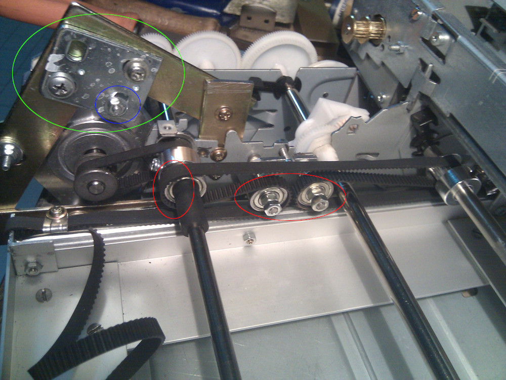
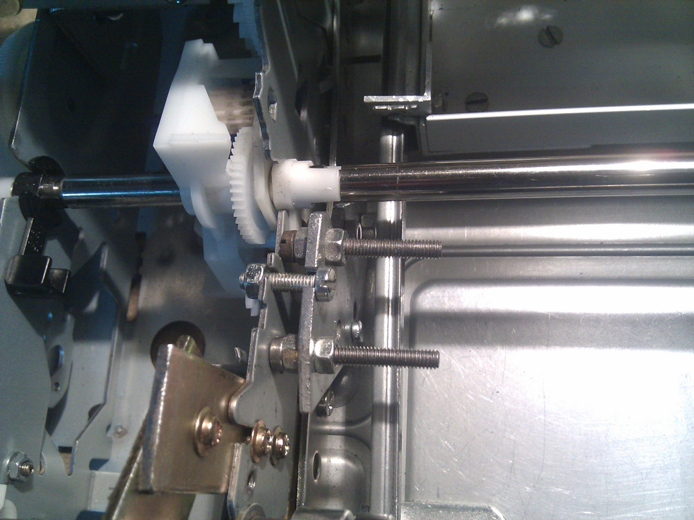
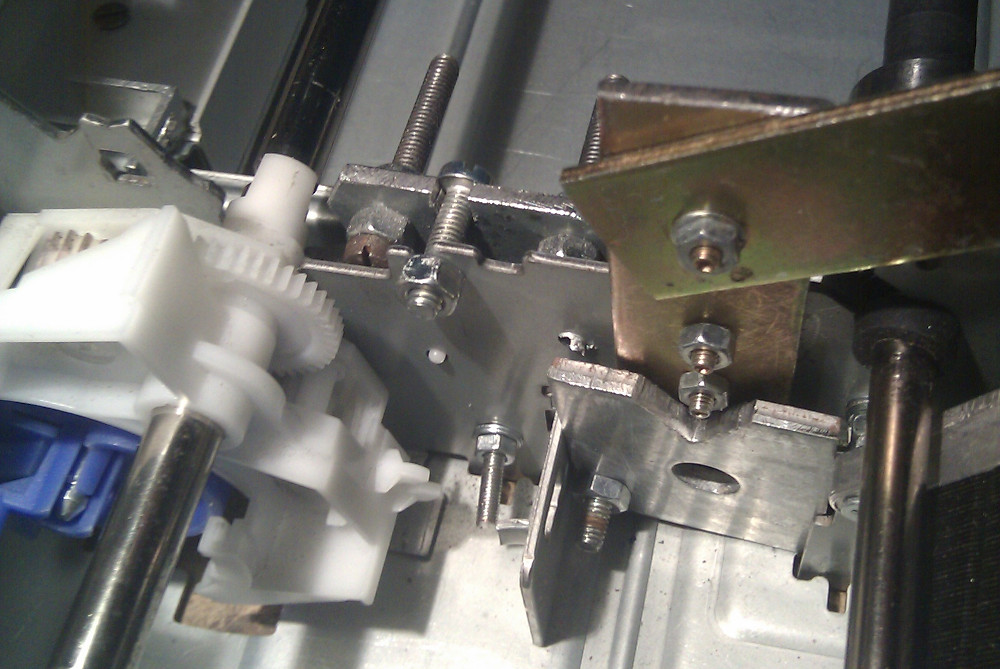
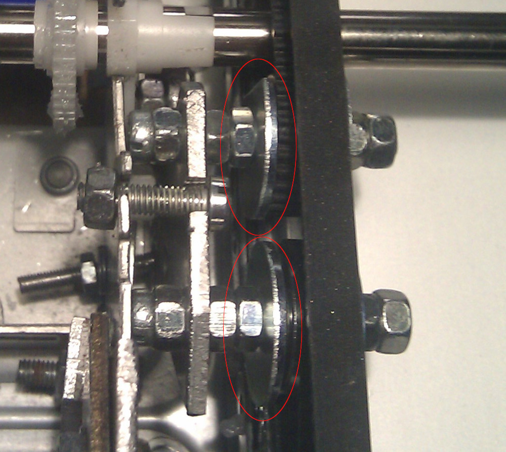
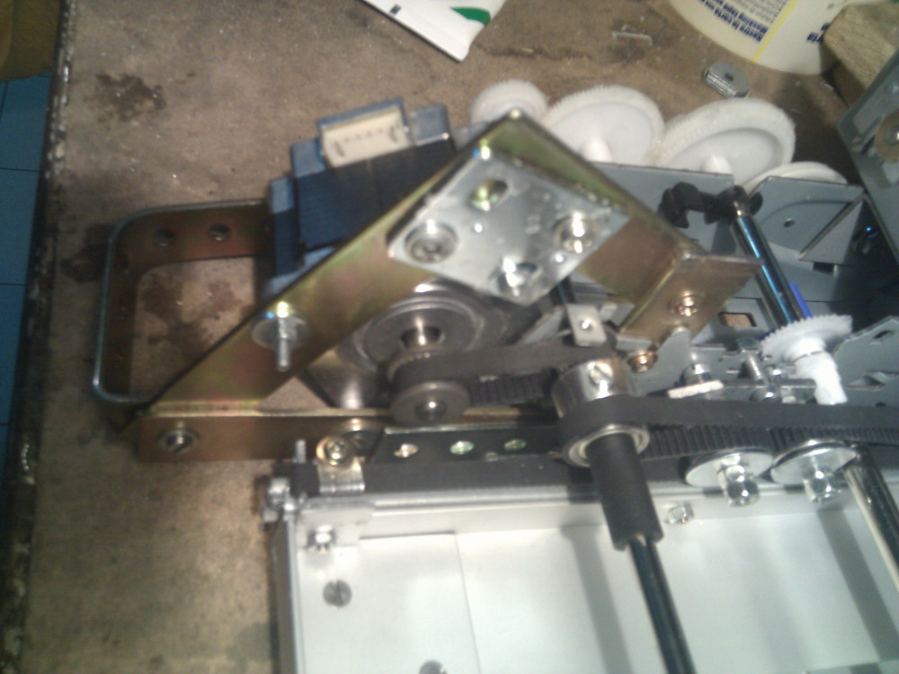
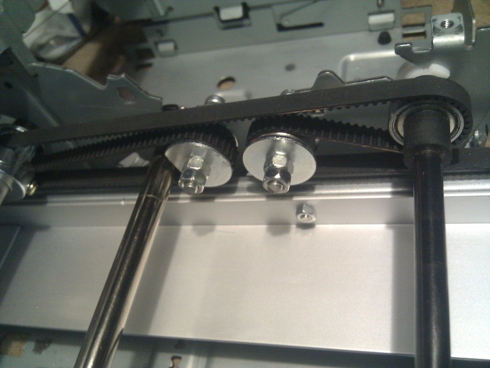
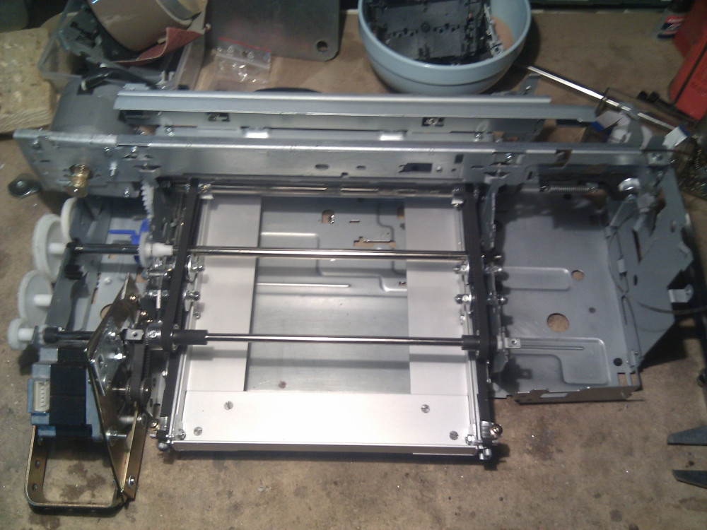

After intensive tests I've noted two things:
- Y-Axis motor has to be fixed on four joints to keep it smooth and stable and that's not a big
  problem, I already have a surrounding square bracket and with a small fix (ringed green) I can
  easily keep the fourth point (ringed blue) tied to the body frame, it's really ugly to see but
  it's fine and works nicely.
- Belts cannot be perfectly aligned and tend to move off ball bearings (see ringed red belts),
  no problems reported with the timing pulleys but moving belts on ball bearings without a
  side protection is not that great. Unfortunately that's not that easy to fix so I need to
  pull them off and place some washers in between. It's not an huge change but has to be done.

It's not an huge change but I can also reconsider minor fixes on ball bearings pivots, as you can
see they're basically built with bolt tied to the machine chassis.

On the back of the pivots I have also fixed everything to the steel plate with different
joints. I have locked everything but without too much pressure in order to avoid bending or
structural damage to the frame.

Here's a closer shot of the pivots, I have inserted two washers for each pivot with the ball bearing
in between. Upper washers are cut (as you can see from the photo) in order to avoid contacts with
the near steel rod. I don't have big washers with M4 diameter so I have just used what I had around,
they're not that big and the width between the washers and the ball bearing is not that high,
anyway it still seems to be sufficient to achieve the job.

And here is an outside view of it, external washers are visible and seems to fit the job and keep
the belt in position

Here's another view on the other side. Left placed washers are cut and this photo clearly shows it.
As noted before the steel rod cannot touch them. Washers are firmly tied to the nuts and
they don't move at all. I don't have a lot of operating hours with
this setup but at first sight seems to work. I'll probably modify these settings later on if 
problems should come out.

And finally some progress on overall view of the project. Belts are tied and Y-Axis transmission
is finally connected to the NEMA23 motor (on left side).  
To make some tests I need to
connect Y-Axis stepper motor to the machine's controller board, stay tuned.

