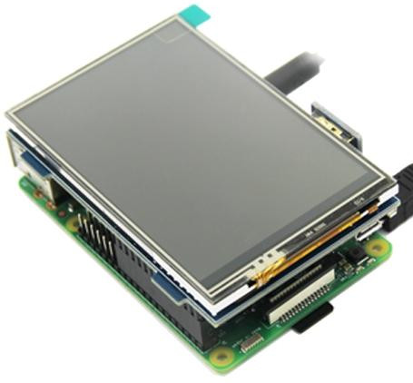
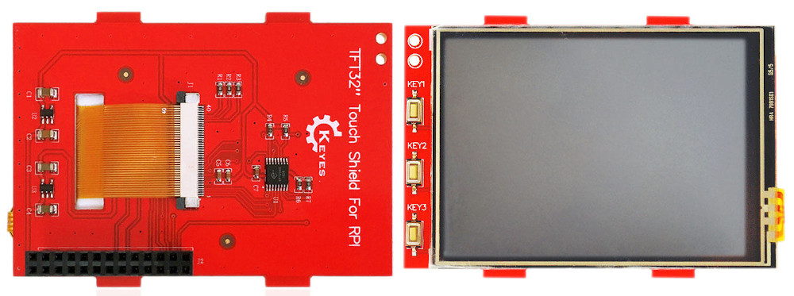
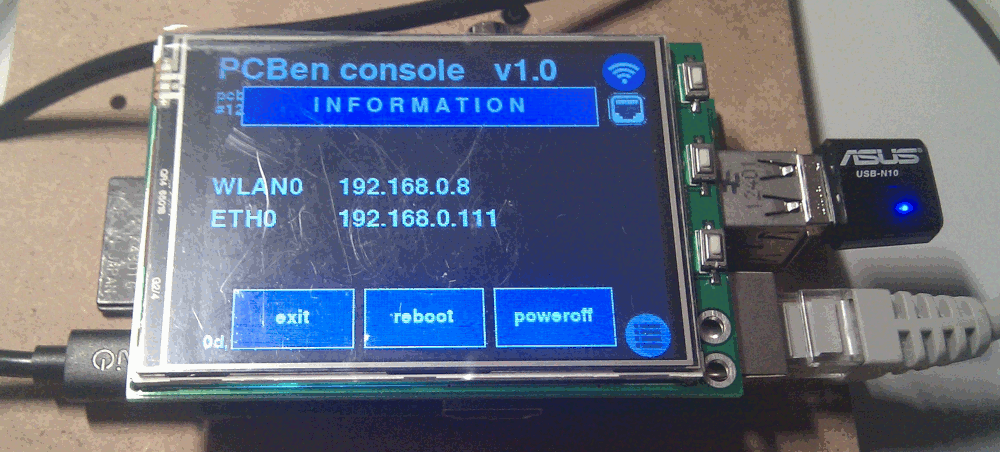

To better deal with GRBL powered arduino devices I need a computer or an embedded appliance,
it's quite common to control Arduino boards from a USB connected PC or laptop. 
In my case I'd like to have a self contained device able to manage everything without a physically
connected computer, an harsh environment but even a personal workshop is not always a place
where you can leave a laptop unattended side by side with a mill.  
That's why I picked up an unused RaspberryPi (v1) I already had around. GRBL firmware does the dirty
job and there's not that much on the Pi to deal with. Computing power needed on the host side is really
poor so a Pi v1 is more than enough but this project is not focused on that particular Pi, you can
use whatever version or embedded device you need (or you already have).
I'll surely publish software when it's ready.  
I'm also adding an embedded screen on the cheap as input peripheral, I have previously purchased 
[this one](https://www.banggood.com/3_2Inch-320x240-Resolution-TFT-LCD-Touch-Screen-for-Raspberry-Pi-3-Model-B2-Model-BB-p-1370870.html?rmmds=search&cur_warehouse=CN)
for 15$ (on sale) but you can easily find similar ones from well known retailers from far east as
usual.  
_Please **note:**_ these cheap TFT screens are mostly designed for acient Pi v1 boards with a short 26pin gpio connection but they can be used on v2,3,4 too as shown from the picture below.

These small TFTs mainly use I2C and SPI for video and touch screen controls, mine has even small
buttons remapped on GPIO as you can see from this image:

AliExpress, Banggood, Amazon, EBay are full of these cheap devices and everything I need is just
a small and minimal interface to start or preload grbl jobs, an ethernet connection is always a
nice have so I can even control it from my desktop located in a warm place.  
X-Window isn't needed so a basic framebuffer program is more than enough, I'm now dealing with a
custom made Python3+pygame interface as you can see from this short preview:

Wired ethernet is now connected just for debugging purposes and the Asus USB-N10 Wireless will
be the only ethernet interface in the final project. If you've a more recent Raspberry with a
builtin wireless card you can avoid the wifi adapter or use the wired ethernet if you prefer.
[Pygame](https://www.pygame.org/) is a perfect choice to design an easy interface without X, I'll
publish the python source code (as well as the complete .img file) when it will become usable.
