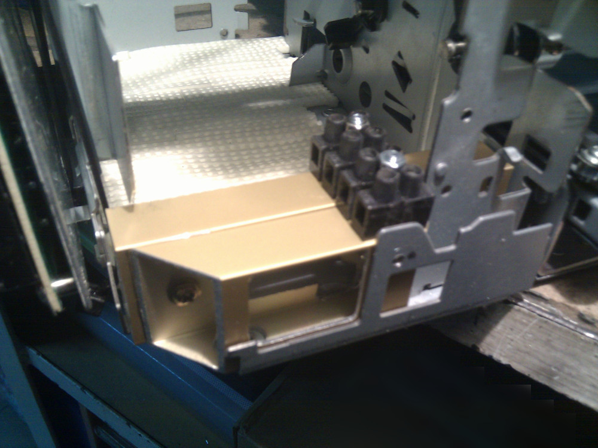
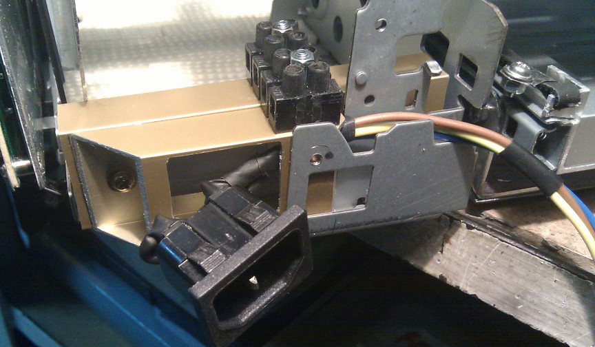
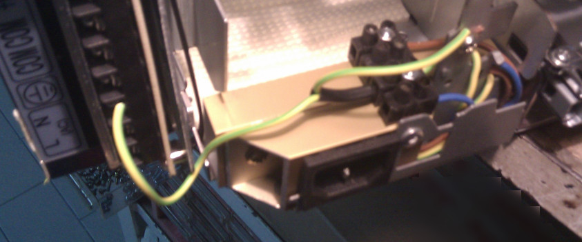
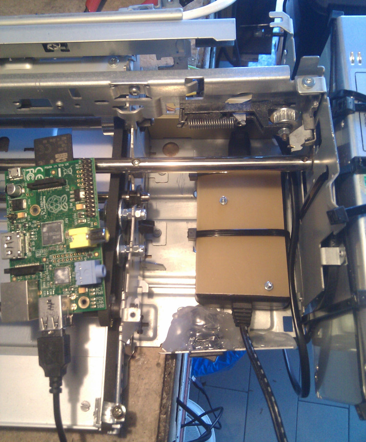

It's time to create some space for electronics: arduino, CNC shield and a small raspberry for job management.
In this CNC machine there will be several boards each one responsible for different tasks, two different DC
voltages will be delivered:
24V DC to the Protoneer board responsible for dealing with NEMA motors and a 5V for the rest, there's a lot
of free space where there was the ink tank and inkjet parking space before, in this area I'll store all these
electronic boards and the power supplies.

To get a stable position for the Shuko socket I have used few spare aluminium bars and placed them on the back
where original electronic board was installed. With few small cuts I have created a place where the Shuko socket
will reside. Few solderings and some hot glue will definitively fix the mains and a small mammut clamps to keep
cables ordered.

The free space previously used for the ink tank is enough for a 5V 2A switching power supply, it's a spare
refurbished supply I already had around; it has barely the same size of a Raspberry so I'll keep them stacked in
the same area with a small polycarbonate in between and some bolts to keep the RPi in the place.
Just like this power supply I'll recycle a really old Raspberry Pi 1, there's no need for huge computing power
so v1 board is enough to deal CAM jobs sent to the Arduino, feel free to use whatever board you prefer, since
there's no need of massive computing power you can choose between Zero,1,2,3,... or whatever you've around.

In the front of the 5V DC power supply I have also placed a small switch to control mains and give voltage to
everything.

